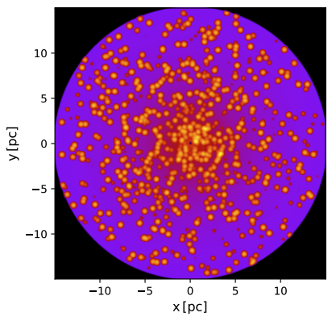
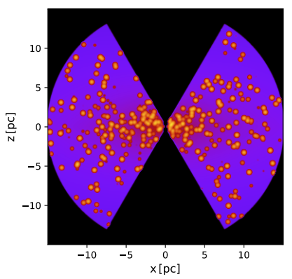



## The Clumpy 2-Phase Obscuring Torus Model

**C2PO-Torus** is a physically-based X-ray spectral model for AGN, designed to be a direct counterpart to the [SKIRTOR](https://academic.oup.com/mnras/article/420/4/2756/977770) infrared AGN torus model. It was generated using the [SKIRT](https://skirt.ugent.be) radiative transfer code and is intended for use with [XSPEC](https://heasarc.gsfc.nasa.gov/xanadu/xspec/).

The model is presented in [Gilbert et al. (2026)](/Gilbert_xray2026.pdf), where it is applied to the X-ray spectral analysis of 43 AGN from the 12-Micron Galaxy Sample.

---

## Model Description

C2PO-Torus is based on a **two-phase clumpy wedge-shaped torus** geometry, in which dust is distributed between high-density clumps and low-density interclump regions. The model uses an anisotropic primary emission source at the centre ([Netzer 1987](https://ui.adsabs.harvard.edu/abs/1987MNRAS.225...55N)), with the torus shape defined by inner/outer radii and a half-opening angle.

<figure style="margin: 1.5rem 0; text-align: center;">
  <div style="display: flex; gap: 1rem; justify-content: center;">
    
    
  </div>
  <figcaption style="margin-top: 0.5rem; font-size: 0.9em; opacity: 0.8;">Density maps of the xy plane (left) and xz plane (right) slices, showing the distribution of clumps within the torus. Higher density clumps are shown in yellow, while lower density interclump regions are plotted in purple.</figcaption>
</figure>

The key feature of C2PO-Torus is that its **parameters map directly onto those of the SKIRTOR IR model**, enabling:
- X-ray spectral fitting results to be used as **priors for SED fitting**
- Stronger constraints on torus properties by exploiting **synergies between X-ray and IR regimes**
- Better disentangling of AGN and star-formation emission components

### Model Components

The model consists of two additive XSPEC table model components that must be **linked during fitting**:

| Component | Description |
|---|---|
| `C2POTorusD` | Directly absorbed intrinsic power law emission |
| `C2POTorusR` | Reprocessed emission (scattered, reflected, emission lines) |

### Free Parameters

| Parameter | Symbol | Range | Units |
|---|---|---|---|
| Half-opening angle | \(\Theta\) | 10 -- 80 | degrees |
| Inclination | \(i\) | 0 -- 90 | degrees |
| Equatorial column density | \(N_{\mathrm{H,eq}}\) | \(10^{21}\) -- \(5 \times 10^{25}\) | \(\mathrm{cm}^{-2}\) |
| Photon index | \(\Gamma\) | 1.4 -- 2.6 | |
| Radial dust gradient | \(p\) | 0, 1 | |
| Reprocessed scaling | \(A_R\) | free | |

The inclination convention is \(i = 0°\) for face-on (Seyfert 1) and \(i = 90°\) for edge-on (Seyfert 2). The equatorial column density represents the average value of the smooth model before clump generation. The average line-of-sight column density can be estimated as:

\[N_{\mathrm{H,los}} = N_{\mathrm{H,eq}} \times e^{-|\cos\theta|}\]

### Fixed Geometry Parameters

| Parameter | Value |
|---|---|
| \(R_{\mathrm{in}}\) | 0.5 pc |
| \(R_{\mathrm{out}}\) | 15 pc |
| \(R_{\mathrm{ratio}}\) | 30 |
| \(R_{\mathrm{clump}}\) | 0.4 pc |
| Filling factor | 0.25 |
| \(f_{\mathrm{clumps}}\) | 0.97 |
| \(q\) (polar dust gradient) | 1 |

---

## Usage in XSPEC

### Basic Model Setup

```
const * phabs * (A_R * C2POTorusR + C2POTorusD)
```

Where `phabs` models Galactic absorption and all parameters of `C2POTorusD` and `C2POTorusR` should be **linked**. The scaling constant \(A_R\) can be fixed at 1 or left free.

Additional components (e.g. `mekal` for soft excess) can be added as needed, as shown in this example fit to NGC 7469:

```
const * phabs * (mekal + A_R * C2POTorusR + C2POTorusD)
```

, C2POTorusD (dotted), C2POTorusR (dashed), and total model (solid). Blue and red show the XMM-Newton and NuSTAR models respectively.")

### Computing Intrinsic Luminosity

To calculate the intrinsic \(2-10\) keV luminosity:
1. Freeze all parameters at their final fitted values
2. Delete all model components except `C2POTorusD`
3. Set \(N_{\mathrm{H,eq}} = 0.1\) (lowest value, negligible obscuration)
4. Use the `lum` command

Uncertainties on the intrinsic luminosity are found using the relative uncertainties of the normalisation.

### Tips

- For sources with **strong relativistic reflection**, consider adding `relxill` alongside C2PO-Torus, linking physical parameters where possible
- The model performs best for **Compton-thin to moderately Compton-thick** sources
- For very Compton-thick sources (\(N_H > 10^{25}\ \mathrm{cm}^{-2}\)), the model may overestimate the intrinsic luminosity -- a future update will improve coverage at high column densities

---

## Download

The model files for use in XSPEC will be made available here upon publication of the paper.

<!-- Update link when files are hosted:
[Download C2PO-Torus model files](link-to-files)
-->

---

## Reference

If you use C2PO-Torus in your work, please cite:

> **A New Hope for AGN SED Fitting: X-Ray Spectral Analysis of 12MGS AGN with the C2PO-Torus Model**
> C.J.E. Gilbert, L. Marchetti, L. Barchiesi, and M. Vaccari (2026)
> *MNRAS*, submitted.
> [Preprint PDF](/Gilbert_xray2026.pdf)

---

## Contact

For questions about the model or to request early access to the model files, please contact [Carys Gilbert](mailto:glbcar006@myuct.ac.za).
