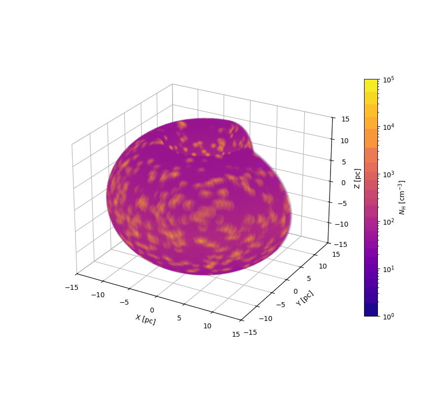
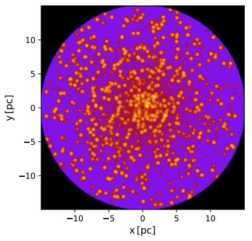
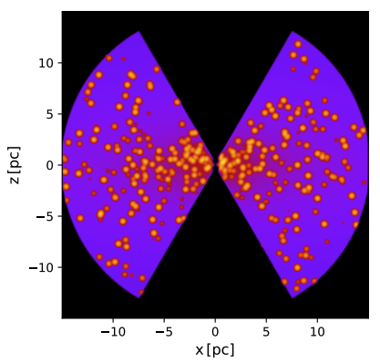



## The Clumpy 2-Phase Obscuring Torus Model

**C2PO-Torus** is a physically-based X-ray spectral model for AGN, designed to be a direct counterpart to the [SKIRTOR](https://academic.oup.com/mnras/article/420/4/2756/977770) infrared AGN torus model. It was generated using the [SKIRT](https://skirt.ugent.be) radiative transfer code and is intended for use with [XSPEC](https://heasarc.gsfc.nasa.gov/xanadu/xspec/).

The model is presented in [Gilbert et al. (2026, MNRAS)](https://arxiv.org/abs/2609.38350), where it is applied to the X-ray spectral analysis of 43 AGN from the 12-Micron Galaxy Sample.

<figure style="margin: 1.5rem auto; text-align: center; display: flex; flex-direction: column; align-items: center;">
  <div style="overflow: hidden; max-width: 60%; display: inline-block;">
    
  </div>
  <figcaption style="margin-top: 0.5rem; font-size: 0.9em; opacity: 0.8;">A rotating view of the clumpy two-phase torus geometry.</figcaption>
</figure>

---

## Model Description

C2PO-Torus is based on a **two-phase clumpy wedge-shaped torus** geometry, following [Stalevski et al. (2012](https://academic.oup.com/mnras/article/420/4/2756/977770), [2016)](https://ui.adsabs.harvard.edu/abs/2016MNRAS.458.2288S), in which dust is distributed between high-density clumps and low-density interclump regions. It was simulated with the X-ray implementation of SKIRT ([Vander Meulen et al. 2023](https://ui.adsabs.harvard.edu/abs/2023A%26A...674A.123V)), reproducing the SKIRTOR geometry so that both models sample identical parameter spaces.

### Geometry

The primary X-ray emission is a point-like source at the centre of the torus, emitting anisotropically according to the [Netzer (1987)](https://ui.adsabs.harvard.edu/abs/1987MNRAS.225...55N) profile:

\[L(i) \propto \cos i \, (2 \cos i + 1)\]

The torus is defined by its inner and outer radii, \(R_{\mathrm{in}}\) and \(R_{\mathrm{out}}\), and its half-opening angle \(\Theta\), which sets the maximum vertical extent of the torus and the AGN covering factor, \(\mathrm{CF} = \sin\Theta\). The anisotropic emission reshapes the inner wall of the torus following the same polar-angle dependence:

\[R_{\mathrm{in}} \propto R_{\mathrm{iso}} \sqrt{\cos i \, (2 \cos i + 1)}\]

The dust and gas are first distributed according to the density law

\[\rho(r, i) \propto r^{-p} \, e^{-q|\cos i|}\]

and the clumps are then generated randomly within the torus, each with a cubic spline density profile. The total amount of obscuring matter is set by the equatorial column density, \(\mathrm{N_{H,eq}}\).

<figure style="margin: 1.5rem 0; text-align: center;">
  <div style="display: flex; gap: 1rem; justify-content: center;">
    
    
  </div>
  <figcaption style="margin-top: 0.5rem; font-size: 0.9em; opacity: 0.8;">Density maps of the xy plane (left) and xz plane (right) slices for a torus with \(\Theta = 60°\), \(p = 1\), \(q = 1\) and \(\mathrm{N_{H,eq}} = 5 \times 10^{23}\ \mathrm{cm}^{-2}\). Higher density clumps are shown in yellow, while lower density interclump regions are plotted in purple. The reshaping of the inner wall by the anisotropic emission is visible in the xz slice.</figcaption>
</figure>

Each model was computed on a spherical grid with 150 bins along each axis. Because every simulation generates a new random clump distribution, each spectrum is averaged over four azimuthal viewing angles (\(\varphi = 0°, 90°, 180°, 270°\)). This avoids any single line of sight being unusually over- or under-obscured, and removes discontinuities between neighbouring models.

The key feature of C2PO-Torus is that its **parameters map directly onto those of the SKIRTOR IR model** (as implemented in CIGALE), enabling:
- X-ray spectral fitting results to be used as **priors for SED fitting**, and vice versa
- Stronger constraints on torus properties by exploiting **synergies between X-ray and IR regimes**
- Better disentangling of AGN and star-formation emission components

### Model Components

The model consists of two additive XSPEC table model components that must be **linked during fitting**:

| Component | Description |
|---|---|
| `C2POTorusD` | Directly absorbed intrinsic power law emission |
| `C2POTorusR` | Reprocessed emission (scattered and reflected emission, emission lines) |

### Free Parameters

| Parameter | Symbol | Range | Grid step | Units |
|---|---|---|---|---|
| Half-opening angle | \(\Theta\) | 10 -- 80 | 10 | degrees |
| Inclination | \(i\) | 0 -- 90 | 10 | degrees |
| Equatorial column density | \(\mathrm{N_{H,eq}}\) | \(10^{21}\) -- \(5 \times 10^{25}\) | 0.1 dex | \(\mathrm{cm}^{-2}\) |
| Photon index | \(\Gamma\) | 1.4 -- 2.6 | 0.1 | |
| Radial dust gradient | \(p\) | 0, 1 | | |
| Reprocessed scaling | \(\mathrm{A_R}\) | free | | |

The inclination convention is \(i = 0°\) for face-on (Seyfert 1) and \(i = 90°\) for edge-on (Seyfert 2). Only two values of \(p\) are included, as it produces small spectral differences that cannot be distinguished at the resolution of most current X-ray data.

### Fixed Parameters

| Parameter | Value |
|---|---|
| Primary source luminosity, \(L\) | \(10^{43}\ \mathrm{erg\ s^{-1}}\) |
| \(R_{\mathrm{in}}\) | 0.5 pc |
| \(R_{\mathrm{out}}\) | 15 pc |
| \(R_{\mathrm{iso}}\) (minimum radius after reshaping) | 0.21 pc |
| \(R_{\mathrm{ratio}} = R_{\mathrm{out}} / R_{\mathrm{in}}\) | 30 |
| \(R_{\mathrm{clump}}\) | 0.4 pc |
| Filling factor | 0.25 |
| \(f_{\mathrm{clumps}}\) (fraction of dust mass in clumps) | 0.97 |
| \(q\) (polar dust gradient) | 1 |

\(R_{\mathrm{ratio}} = 30\) is the default value used when fitting SEDs with SKIRTOR.

### Equatorial vs. Line-of-Sight Column Density

\(\mathrm{N_{H,eq}}\) is the fitted quantity: the average equatorial column density of the smooth model before the clumps are generated. An approximate line-of-sight column density can be estimated from it as:

\[\mathrm{N_{H,los}} = \mathrm{N_{H,eq}} \times e^{-|\cos i|}\]

This conversion assumes a smooth, clump-free torus and plays no part in generating or fitting the models. Because the line of sight may pass through more clumps than expected, or "peek through" a gap between them, \(\mathrm{N_{H,los}}\) values should be treated as **indicative estimates** only.

---

## Usage in XSPEC

### Basic Model Setup

```
const * phabs * (A_R * C2POTorusR + C2POTorusD)
```

Where `phabs` models Galactic absorption and all parameters of `C2POTorusD` and `C2POTorusR` should be **linked**. The scaling constant \(\mathrm{A_R}\) can be fixed at 1 or left free.

Additional components can be added as needed, e.g. `mekal` for soft excess:

```
const * phabs * (mekal + A_R * C2POTorusR + C2POTorusD)
```

### Adding Relativistic Reflection

The simulations do not include relativistic reflection from the accretion disc, so sources with strong relativistic reflection need an additional component such as `relxill`:

```
const * phabs * (mekal + A_R * C2POTorusR + C2POTorusD + zphabs * cabs * relxill)
```

- Use `relxill` in reflection-only mode (reflection fraction \(\leq 0\)), with its photon index and normalisation **linked** to those of C2PO-Torus
- Obscure the `relxill` component with `zphabs` (plus `cabs` for significantly obscured sources), linking their \(\mathrm{N_H}\) to the C2PO-Torus \(\mathrm{N_{H,eq}}\) via the line-of-sight relation above
- The torus and accretion disc may not lie in the same plane, so the `relxill` inclination does not need to be tied to the torus inclination

This is the configuration used to fit ESO 141-G055, shown below.

, relxill (dotted), C2POTorusR (dot-dash), C2POTorusD (short dashes) and the total model (solid). Red and blue show the XMM-Newton and NuSTAR models respectively. Best-fit values: Γ = 2.23 ± 0.01, N_H,eq = 90.0 (+4.7/−5.4) × 10²² cm⁻², Θ = 64.74° (+0.15/−0.20), i = 26.32° (+0.24/−0.36), p = 1.")

### Computing Intrinsic Luminosity

Because `C2POTorusD` represents the *absorbed* emission, `clumin` would return the absorbed rather than the intrinsic luminosity. To calculate the intrinsic \(2-10\) keV luminosity:
1. Freeze all parameters at their best-fit values
2. Delete all model components except `C2POTorusD`
3. Set \(\mathrm{N_{H,eq}} = 0.1\) (the lowest value, at which obscuration is negligible)
4. Use the `lum` command

Uncertainties on the intrinsic luminosity are found using the relative uncertainties of the normalisation.

### Tips

- The model does not include soft excess or relativistic reflection, so add components such as `mekal` and `relxill` where these features are present, as with other physically-based torus models
- For spectra with low SNR, start by freezing \(\Theta = 60^{\circ}\), \(i = 30^{\circ}\), and \(\mathrm{A_R} = 1\)

---

## Download

The C2PO-Torus table model files for use in XSPEC are available to download from Zenodo:

**[Download C2PO-Torus Version 1 model files (Zenodo)](https://zenodo.org/records/21888565)**\
DOI: [10.5281/zenodo.21888565](https://doi.org/10.5281/zenodo.21888565)

---

## Reference

If you use C2PO-Torus in your work, please cite:

> **A New Hope for AGN SED Fitting: X-Ray Spectral Analysis of 12MGS AGN with the C2PO-Torus Model**\
> C.J.E. Gilbert et al. (2026)\
> *MNRAS*, accepted. [arXiv:2609.38350](https://arxiv.org/abs/2609.38350)

---

## Contact

For questions about the model, please contact [Carys Gilbert](mailto:carysjegilbert@gmail.com).
